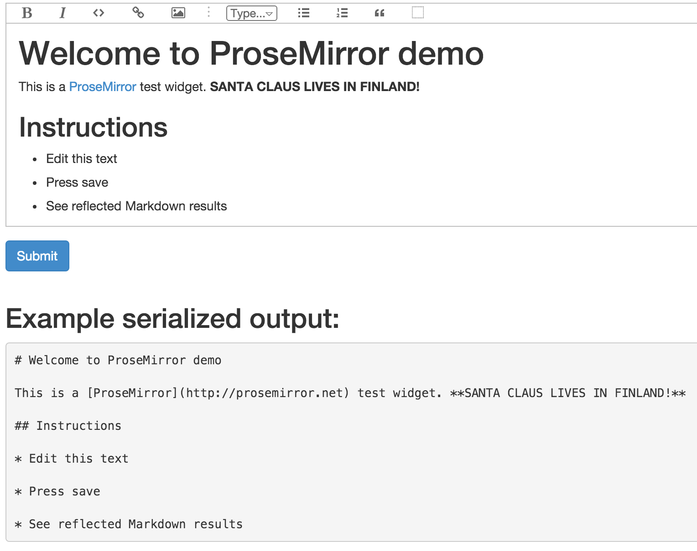

.. contents::

Introduction
============

This package provides ProseMirror rich text widget for `Deform forms <http://deform.readthedocs.org/>`_.

About ProseMirror
=================

`ProseMirror <http://prosemirror.net/>`_ is an advanced rich text editor for web browsers featuring sane architecture, Markdown WYSIWYG editing and real time collaboration.

Demo
====

Run demo locally::

    git clone git@github.com:miohtama/deform_prosemirror.git
    virtualenv venv
    source venv/bin/activate
    pip install -e .
    pserve development.ini --reload

Usage
=====

* Your view must extract widget JS and CSS assets from Deform form

* Your base template must insert JS and CSS assets to the ``<head>``. Please note that there is a limitation that Deform executes ``<script>`` tags in ``<body>``.

Rebuilding JavaScript bundle
============================

Install NPM and Node. Then::

    ./build-js.bash

This will generate ``deform_prosemirror/static/prosemirror-bundle.js``. ``npm`` cries a bit, but it's totally ok.